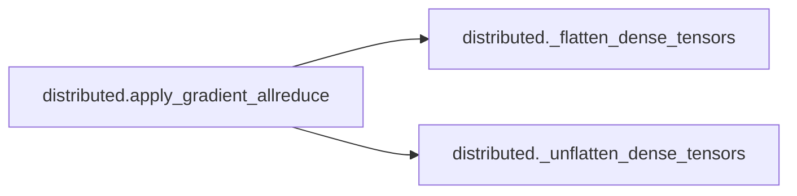

# Key Objects

[_Documentation generated by Documatic_](https://www.documatic.com)

<!---Documatic-section-audio_processing.dynamic_range_compression-start--->
## audio_processing.dynamic_range_compression

<!---Documatic-section-dynamic_range_compression-start--->
<!---Documatic-block-audio_processing.dynamic_range_compression-start--->
<details>
	<summary><code>audio_processing.dynamic_range_compression</code> code snippet</summary>

```python
def dynamic_range_compression(x, C=1, clip_val=1e-05):
    return torch.log(torch.clamp(x, min=clip_val) * C)
```
</details>
<!---Documatic-block-audio_processing.dynamic_range_compression-end--->
<!---Documatic-section-dynamic_range_compression-end--->

# #
<!---Documatic-section-audio_processing.dynamic_range_compression-end--->

<!---Documatic-section-audio_processing.window_sumsquare-start--->
## audio_processing.window_sumsquare

<!---Documatic-section-window_sumsquare-start--->
<!---Documatic-block-audio_processing.window_sumsquare-start--->
<details>
	<summary><code>audio_processing.window_sumsquare</code> code snippet</summary>

```python
def window_sumsquare(window, n_frames, hop_length=200, win_length=800, n_fft=800, dtype=np.float32, norm=None):
    if win_length is None:
        win_length = n_fft
    n = n_fft + hop_length * (n_frames - 1)
    x = np.zeros(n, dtype=dtype)
    win_sq = get_window(window, win_length, fftbins=True)
    win_sq = librosa_util.normalize(win_sq, norm=norm) ** 2
    win_sq = librosa_util.pad_center(win_sq, n_fft)
    for i in range(n_frames):
        sample = i * hop_length
        x[sample:min(n, sample + n_fft)] += win_sq[:max(0, min(n_fft, n - sample))]
    return x
```
</details>
<!---Documatic-block-audio_processing.window_sumsquare-end--->
<!---Documatic-section-window_sumsquare-end--->

# #
<!---Documatic-section-audio_processing.window_sumsquare-end--->

<!---Documatic-section-distributed.init_distributed-start--->
## distributed.init_distributed

<!---Documatic-section-init_distributed-start--->
<!---Documatic-block-distributed.init_distributed-start--->
<details>
	<summary><code>distributed.init_distributed</code> code snippet</summary>

```python
def init_distributed(rank, num_gpus, group_name, dist_backend, dist_url):
    assert torch.cuda.is_available(), 'Distributed mode requires CUDA.'
    print('Initializing Distributed')
    torch.cuda.set_device(rank % torch.cuda.device_count())
    dist.init_process_group(dist_backend, init_method=dist_url, world_size=num_gpus, rank=rank, group_name=group_name)
```
</details>
<!---Documatic-block-distributed.init_distributed-end--->
<!---Documatic-section-init_distributed-end--->

# #
<!---Documatic-section-distributed.init_distributed-end--->

<!---Documatic-section-mel2samp.files_to_list-start--->
## mel2samp.files_to_list

<!---Documatic-section-files_to_list-start--->
<!---Documatic-block-mel2samp.files_to_list-start--->
<details>
	<summary><code>mel2samp.files_to_list</code> code snippet</summary>

```python
def files_to_list(filename):
    with open(filename, encoding='utf-8') as f:
        files = f.readlines()
    files = [f.rstrip() for f in files]
    return files
```
</details>
<!---Documatic-block-mel2samp.files_to_list-end--->
<!---Documatic-section-files_to_list-end--->

# #
<!---Documatic-section-mel2samp.files_to_list-end--->

<!---Documatic-section-distributed._flatten_dense_tensors-start--->
## distributed._flatten_dense_tensors

<!---Documatic-section-_flatten_dense_tensors-start--->
<!---Documatic-block-distributed._flatten_dense_tensors-start--->
<details>
	<summary><code>distributed._flatten_dense_tensors</code> code snippet</summary>

```python
def _flatten_dense_tensors(tensors):
    if len(tensors) == 1:
        return tensors[0].contiguous().view(-1)
    flat = torch.cat([t.contiguous().view(-1) for t in tensors], dim=0)
    return flat
```
</details>
<!---Documatic-block-distributed._flatten_dense_tensors-end--->
<!---Documatic-section-_flatten_dense_tensors-end--->

# #
<!---Documatic-section-distributed._flatten_dense_tensors-end--->

<!---Documatic-section-distributed._unflatten_dense_tensors-start--->
## distributed._unflatten_dense_tensors

<!---Documatic-section-_unflatten_dense_tensors-start--->
<!---Documatic-block-distributed._unflatten_dense_tensors-start--->
<details>
	<summary><code>distributed._unflatten_dense_tensors</code> code snippet</summary>

```python
def _unflatten_dense_tensors(flat, tensors):
    outputs = []
    offset = 0
    for tensor in tensors:
        numel = tensor.numel()
        outputs.append(flat.narrow(0, offset, numel).view_as(tensor))
        offset += numel
    return tuple(outputs)
```
</details>
<!---Documatic-block-distributed._unflatten_dense_tensors-end--->
<!---Documatic-section-_unflatten_dense_tensors-end--->

# #
<!---Documatic-section-distributed._unflatten_dense_tensors-end--->

<!---Documatic-section-distributed.reduce_tensor-start--->
## distributed.reduce_tensor

<!---Documatic-section-reduce_tensor-start--->
<!---Documatic-block-distributed.reduce_tensor-start--->
<details>
	<summary><code>distributed.reduce_tensor</code> code snippet</summary>

```python
def reduce_tensor(tensor, num_gpus):
    rt = tensor.clone()
    dist.all_reduce(rt, op=dist.reduce_op.SUM)
    rt /= num_gpus
    return rt
```
</details>
<!---Documatic-block-distributed.reduce_tensor-end--->
<!---Documatic-section-reduce_tensor-end--->

# #
<!---Documatic-section-distributed.reduce_tensor-end--->

<!---Documatic-section-distributed.apply_gradient_allreduce-start--->
## distributed.apply_gradient_allreduce

<!---Documatic-section-apply_gradient_allreduce-start--->


### Object Calls

* distributed._flatten_dense_tensors
* distributed._unflatten_dense_tensors

<!---Documatic-block-distributed.apply_gradient_allreduce-start--->
<details>
	<summary><code>distributed.apply_gradient_allreduce</code> code snippet</summary>

```python
def apply_gradient_allreduce(module):
    if not hasattr(dist, '_backend'):
        module.warn_on_half = True
    else:
        module.warn_on_half = True if dist._backend == dist.dist_backend.GLOO else False
    for p in module.state_dict().values():
        if not torch.is_tensor(p):
            continue
        dist.broadcast(p, 0)

    def allreduce_params():
        if module.needs_reduction:
            module.needs_reduction = False
            buckets = {}
            for param in module.parameters():
                if param.requires_grad and param.grad is not None:
                    tp = type(param.data)
                    if tp not in buckets:
                        buckets[tp] = []
                    buckets[tp].append(param)
            if module.warn_on_half:
                if torch.cuda.HalfTensor in buckets:
                    print('WARNING: gloo dist backend for half parameters may be extremely slow.' + ' It is recommended to use the NCCL backend in this case. This currently requires' + 'PyTorch built from top of tree master.')
                    module.warn_on_half = False
            for tp in buckets:
                bucket = buckets[tp]
                grads = [param.grad.data for param in bucket]
                coalesced = _flatten_dense_tensors(grads)
                dist.all_reduce(coalesced)
                coalesced /= dist.get_world_size()
                for (buf, synced) in zip(grads, _unflatten_dense_tensors(coalesced, grads)):
                    buf.copy_(synced)
    for param in list(module.parameters()):

        def allreduce_hook(*unused):
            Variable._execution_engine.queue_callback(allreduce_params)
        if param.requires_grad:
            param.register_hook(allreduce_hook)
            dir(param)

    def set_needs_reduction(self, input, output):
        self.needs_reduction = True
    module.register_forward_hook(set_needs_reduction)
    return module
```
</details>
<!---Documatic-block-distributed.apply_gradient_allreduce-end--->
<!---Documatic-section-apply_gradient_allreduce-end--->

# #
<!---Documatic-section-distributed.apply_gradient_allreduce-end--->

<!---Documatic-section-audio_processing.dynamic_range_decompression-start--->
## audio_processing.dynamic_range_decompression

<!---Documatic-section-dynamic_range_decompression-start--->
<!---Documatic-block-audio_processing.dynamic_range_decompression-start--->
<details>
	<summary><code>audio_processing.dynamic_range_decompression</code> code snippet</summary>

```python
def dynamic_range_decompression(x, C=1):
    return torch.exp(x) / C
```
</details>
<!---Documatic-block-audio_processing.dynamic_range_decompression-end--->
<!---Documatic-section-dynamic_range_decompression-end--->

# #
<!---Documatic-section-audio_processing.dynamic_range_decompression-end--->

[_Documentation generated by Documatic_](https://www.documatic.com)